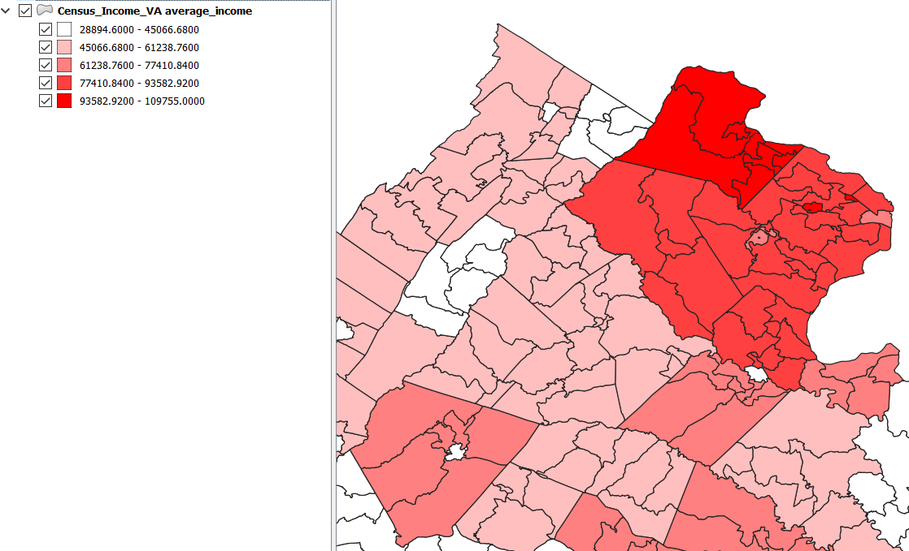
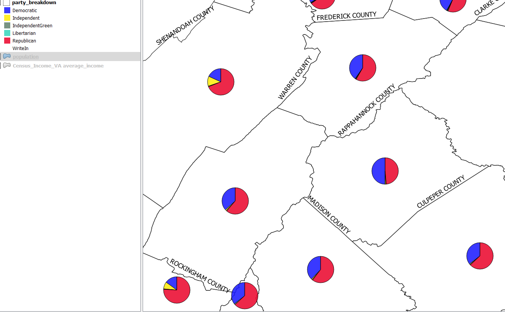
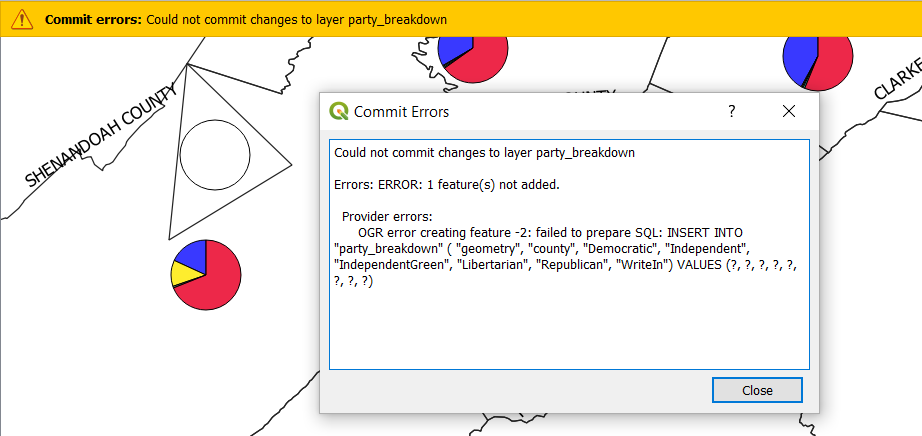
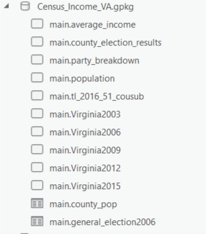
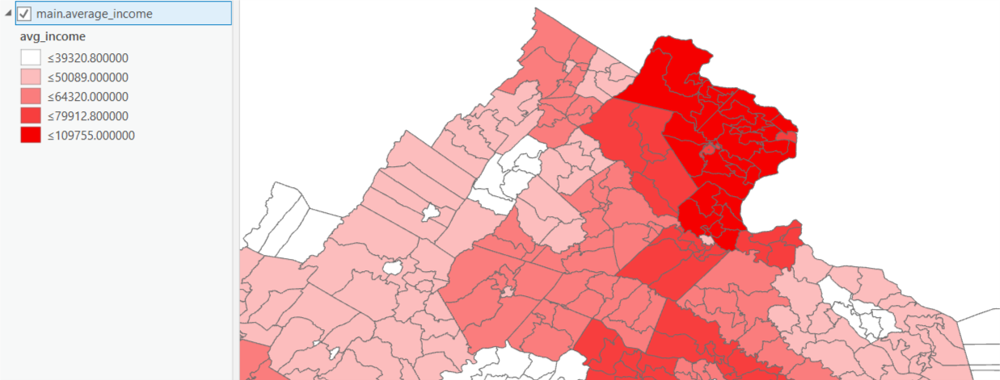
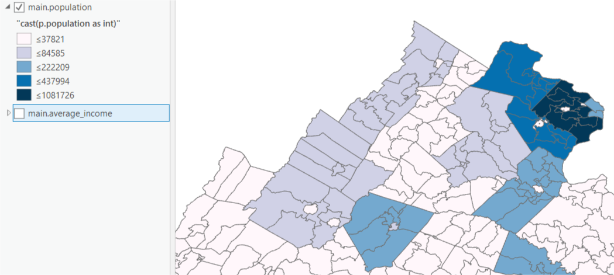
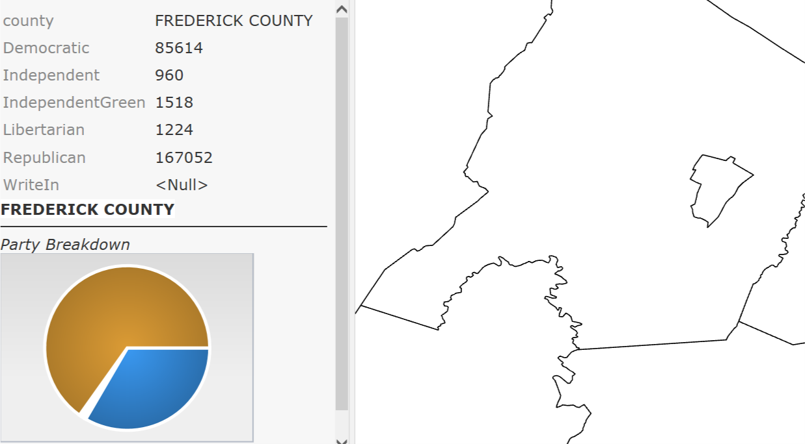
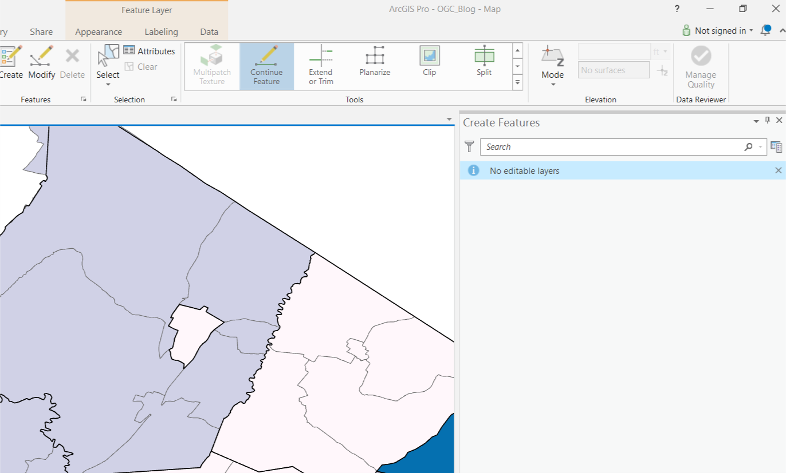
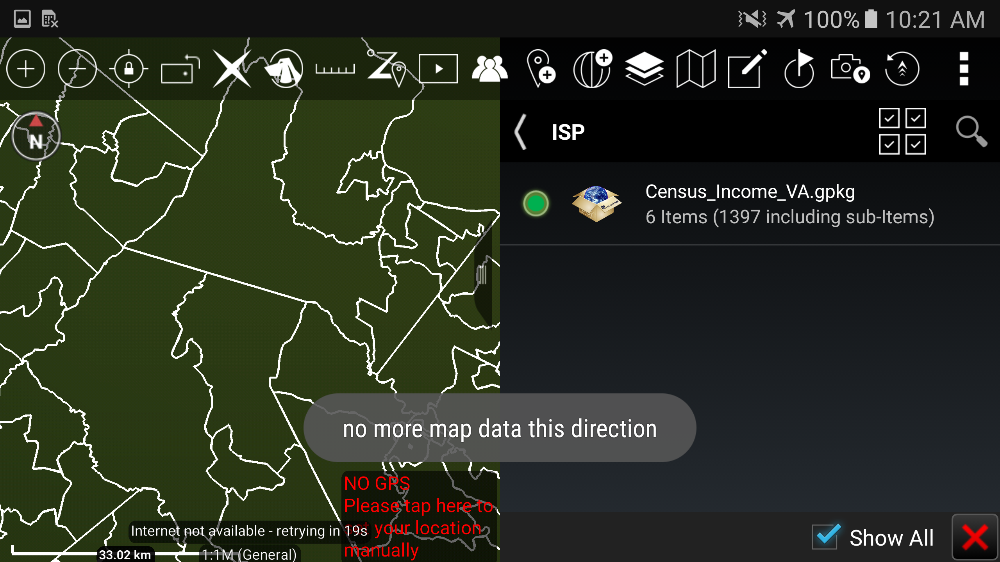
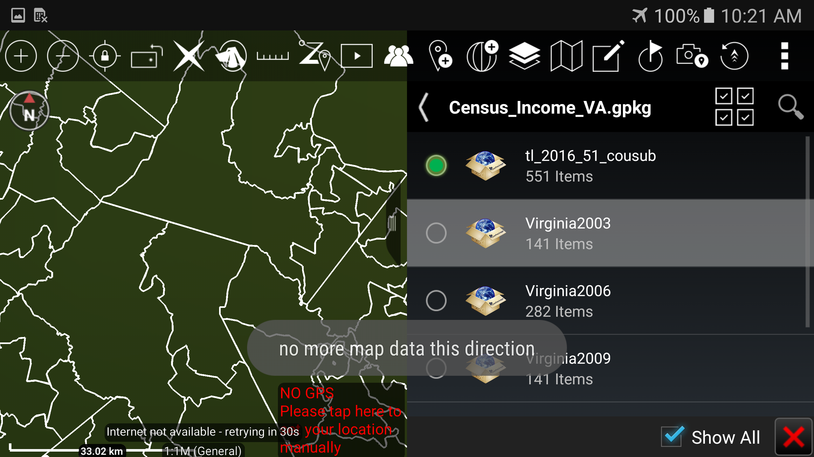

# GPKG View Assessment

## US_Census_VA.gpkg
This geopackage was created using public data from the US Census and Virginia Board of Election.
Source:

- [US Census TIGER](https://www.census.gov/geo/maps-data/data/tiger.html)
- [VA Board of Elections](https://apps.elections.virginia.gov/SBE_CSV/ELECTIONS/ELECTIONRESULTS/)

It contains 5 tables:

|Table Name| Data Type| Description|
|----------|----------|------------|
|`VirginiaYYYY`| Feature| Median income per VA county for year (title) and polygon outlining the county|
|`tl_2016_51_cousub`| Feature| Polygon table of individual districts with in VA. These can be  grouped by the column 'countyfp'|
|`county_pop_2010` | Attributes | Contains the VA county Populations for 2010|
|`general_election2006` | Attributes| VA county election results for the 2006 general election|


The Following views where created using the Sqlite3 Library. Each view was inserted in to  `gpkg_contents` and `gpkg_geometry_columns` tables as feature tables.

- `average_income`
+
```SQL
CREATE VIEW average_income AS
                SELECT m.name as county, t.name as district, m.avg_income, t.geom as geometry FROM
                    (SELECT m.name, m.countyfp, avg(m.medianinco) as avg_income FROM
                        (SELECT countyfp, name, medianinco from virginia2003
        		               UNION
        	             SELECT countyfp, name, medianinco from virginia2006
        		               UNION
        	             SELECT countyfp, name, medianinco from virginia2009
        		               UNION
        	             SELECT countyfp, name, medianinco from virginia2012
        		               UNION
        	             SELECT countyfp, name, medianinco from virginia2015
        	                ) m
        	                   GROUP BY m.name, m.countyfp ) m
        	    JOIN tl_2016_51_cousub t ON t.countyfp = m.countyfp;
```

- `population`
+
```SQL
CREATE VIEW population AS
                SELECT p.couname as county, t.name as district, cast(p.population as int) as population, t.geom as geometry FROM tl_2016_51_cousub t
                	JOIN county_pop_2010 p ON p.countyfp = t.countyfp;
                  ```
+
- `county_election_results`
+
```SQL
CREATE VIEW county_election_results AS
            SELECT g.localityname, g.party, g.total_votes, p.population, t.geom as geometry FROM
                (select localityname, coalesce(party,'Write In') as party, sum(total_votes) as total_votes from general_election2006 GROUP BY localityname, party) g
                    JOIN
                (select countyfp, couname || ' COUNTY' as county, population from county_pop_2010) p ON p.county = g. localityname COLLATE NOCASE
            JOIN tl_2016_51_cousub t ON t.countyfp=p.countyfp;
            ```
+
-`party_breakdown`
+
```SQL
CREATE VIEW party_breakdown AS
        SELECT c.county, d.total_votes as Democratic,
				 i.total_votes as Independent,
				 ig.total_votes as IndependentGreen,
				 l.total_votes as Libertarian,
				 r.total_votes as Republican,
				 w.total_votes as WriteIn,
				 v.geom as geometry
				FROM
        	(select localityname as county from general_election2006 group by localityname) c
        		LEFT JOIN
        	(select localityname as county, sum(total_votes) as total_votes from county_election_results where party='Democratic' group by localityname, party) d on d.county = c.county
        		LEFT JOIN
        	(select localityname as county, sum(total_votes) as total_votes from county_election_results where party='Independent' group by localityname, party) i on i.county = c.county
        		LEFT JOIN
        	(select localityname as county, sum(total_votes) as total_votes from county_election_results where party='Independent Green' group by localityname, party) ig on ig.county = c.county
        		LEFT JOIN
        	(select localityname as county, sum(total_votes) as total_votes from county_election_results where party='Libertarian' group by localityname, party) l on l.county = c.county
        		LEFT JOIN
        	(select localityname as county, sum(total_votes) as total_votes from county_election_results where party='Republican' group by localityname, party) r on r.county = c.county
        		LEFT JOIN
        	(select localityname as county, sum(total_votes) as total_votes from county_election_results where party IS NULL  group by localityname, party) w on w.county = c.county
        		JOIN Virginia2003 v ON v.name || ' COUNTY' = c.county collate NOCASE;
                    ```

## Qgis 3.2-Bonn

Qgis was able to read the view, although it made no indication which layer was a view (fig 1). However, each view able to be rendered (figs 2-4). The layer was made availbe to edit, but recieved an `SQL INSERT ` error in attempting to add add new features to the table (fig 5).


| | |
|-|-|
|||
|figure 1|figure 2|
|||
|figure 3|figure 4|
|||
|figure 5

## ArcGIS Pro 2.2 (Patch 4)
Same behavior was seen in ArGIS Pro for rendering. Prior to loading layer into map, user prompted to select a unique field per ArcGIS [requirements](http://desktop.arcgis.com/en/arcmap/latest/manage-data/databases/unique-identifier-fields-in-database-tables.htm). Additionally, Pro inidicated that the view layers were not editable.


| | |
|-|-|
|||
|figure 6| figure 7|
||
|figure 8| figure 9|
|||


## ATAK 3.6
The geopackage was loading into a test version of ATAK3.6, with the ISP Plugin. The views were not listed as available layers, but the feature tables were.

| | |
|-|-|
|||

## MapCache (NGA, unknown version)
Same behavior with MapCache as ATAK, however, this is an old working version we had in the AGE Node.


